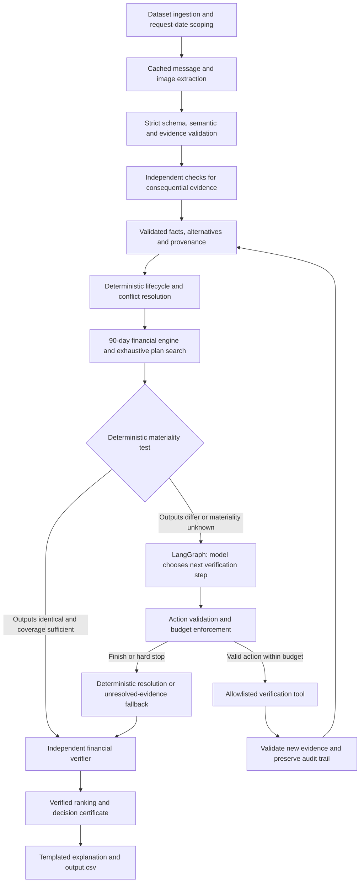

**Frozen architecture: Deterministic Evidence Compiler and Financial Engine with Gated LangGraph Verification.**

The model interprets evidence and chooses bounded verification steps. Deterministic code owns financial rules, calculations, candidate generation, safety, ranking, and final output.

**1. Input and evidence compilation**

Read only participant-facing inputs from `dataset/`. Build a packet for each request containing its profile, events, payment options, messages, images, and applicable FX records.

- Scope evidence by user, request, event association, and knowledge available on `request_date`.
- Start from `current_available_balance`; do not replay historical settled transactions as additional cash.
- Preserve historical records for recurrence inference.
- Resolve missing event amounts through linked images; blank never means zero.
- User-level evidence may apply to a recurring series or introduce an obligation without identifying an existing event.

**2. Strict extraction contract**

Models extract financial meaning, not decisions.

| Source | Model output |
|---|---|
| Messages | Confirmations, cancellations, amount/date amendments, delays, recurrence scope, lifecycle claims, and new obligations |
| Images | Labeled amounts, currency, applicable dates, relevant document fields, and evidence regions |
| Ambiguous evidence | Supported alternative interpretations and unresolved fields |

Every extraction records:

- Source ID, content hash, and exact text span or image region.
- Target event, recurring series, or new obligation.
- Candidate values, dates, currency, and applicability.
- Supporting evidence for each candidate.
- Mutually exclusive or jointly applicable alternatives.
- Unresolved fields and coverage-check status.

**Validate every model response before consuming it:** strict types, required fields, permitted enums, no unexpected properties, valid identifiers, correct scope, and evidence support. Reject malformed or unsupported output; never silently patch it.

**3. Independent extraction checks**

Require a second extraction for:

- Image-derived financial amounts.
- Messages changing income, obligations, settlement dates, or recurrence scope.
- Messages introducing financial facts without an existing event row.

The second extractor sees the original evidence without the first answer. Use deterministic checks for document arithmetic, currency, dates, labels, and unmapped financial clauses.

When extractions disagree:

1. Compare the underlying evidence and event meaning.
2. Apply the challenge’s source-conflict precedence where applicable.
3. Preserve remaining supported alternatives.
4. Select the financially safer interpretation when justified.
5. Keep unreadable or missing material facts unresolved.

A later model response has no greater authority merely because it ran later. Agreement supports an interpretation but does not prove it.

**4. Deterministic financial engine**

Ordinary Python with decimal arithmetic owns:

| Component | Responsibility |
|---|---|
| Lifecycle resolution | Distinguish duplicates, replacements, retries, disputes, reversals, and separate cash movements |
| Conflict resolution | Apply explicit cancellation/settlement/amendment, newer same-source evidence, settled-over-estimate, then safer interpretation |
| Recurrence | Infer supported cadence; separate regular payments from one-time amounts; apply amendments with correct scope |
| Variable spending | Forecast conservative category-period spending without double-counting fixed obligations |
| FX | Use exact settlement-date and directed supplied rates |
| Simulation | Replay cash movements and payment plans through the fixed 90-day forecast |
| Capacity | Calculate maximum safe payment today before optional changes |
| Earliest date | Find the first safe single-full-payment date, independently of preferences and optional changes |
| Candidate search | Enumerate full payment, prescribed partial payment, supplied installments, wait, and eligible spending-change variants |
| Ranking | Apply the six official criteria in their stated order |

Critical rules:

- Reserve applicable pending debits; exclude pending credits and unsupported income.
- Do not count failed, cancelled, or unrealized records as available cash.
- `linked_event_id` alone never determines cash treatment.
- Partial payment uses exactly the prescribed two payments and passes combined-trajectory verification.
- Installments retain supplied dates and amounts; financing fees are not added twice.
- Spending changes target eligible flexible recurring expenses, respect floors and protected categories, and use at most three distinct actions.
- `earliest_date_for_full_payment` may remain populated even when no eligible recommendation is available.

Recurrence thresholds, variable-spend estimation, boundary inclusivity, same-day ordering, installment-month interpretation, and rounding remain **versioned policies requiring experiments**. Freezing the architecture does not turn these unresolved semantics into established rules.

**5. Operational materiality test**

After supported conflict resolution:

1. Construct coherent combinations of remaining evidence-backed interpretations.
2. Run the deterministic engine for each combination.
3. Produce canonical values for **all eight output fields**, including the templated explanation.
4. Compare the results.

- **Any difference:** material; open the verification gate.
- **Identical outputs:** immaterial only after required extraction checks and complete evaluation of represented admissible combinations.
- **Unbounded facts, incomplete coverage, or enumeration-cap exhaustion:** materiality unknown; do not silently close the gate.

Check interacting ambiguities together. This proves stability across represented interpretations—not that extraction discovered every possible interpretation.

**6. Gated LangGraph verification**

Clean requests skip the controller. For material or unresolved cases, the **model chooses the next verification step**, rather than following a fixed checklist.

Allowlisted actions:

- Compare contradictory evidence.
- Retrieve exact supporting records.
- Check temporary versus ongoing amendment scope.
- Reinspect an image field.
- Investigate linked-event meaning.
- Request a predefined deterministic sensitivity test.

Each action names its target, evidence references, and uncertainty to resolve.

**Hard limits:**

- Maximum three controller turns.
- Maximum three verification actions, one per turn.
- At most one specialist model invocation per action.
- Invalid controller responses consume budget.
- Initial extraction and independent checks have separate finite budgets.
- Application counters enforce limits; LangGraph’s recursion limit is only a secondary safeguard.

Stop early when appropriate. At exhaustion, apply supported deterministic resolution. A timeout alone does not mean `not_affordable`; material unknowns block only recommendations whose safety depends on resolving them.

**7. Evidence-security boundary**

This component owns prompt-injection defenses:

- Messages and images are untrusted evidence, never governing instructions.
- Supply evidence by reference with necessary excerpts clearly marked untrusted.
- Use closed action schemas and allowlisted tools.
- Validate actions before execution and evidence before acceptance.
- Models cannot modify rules, budgets, permissions, or final financial fields.

Schema validation supports this boundary; it does not replace it.

**8. Independent verification and exact provenance**

The final verifier always runs. It independently checks:

- Baseline capacity and earliest-date minimality.
- Full-trajectory minimum-balance safety.
- Eligibility, deadlines, exact installment schedules, and partial-payment identities.
- Spending-change permissions and official ranking.
- Output schema, identifiers, dates, amounts, and field consistency.

Every output field has a trace:

**Output field → calculation/rule → accepted fact → exact source evidence.**

The decision certificate records the selected plan, binding constraints, minimum projected balance, rejected alternatives, policy versions, and unresolved limitations. Explanations are generated deterministically from this certificate.

The certificate means **“safe under these accepted facts and forecast policies.”** It does not certify that extraction is infallible.

**9. Caching and usage accounting**

Cache immutable source extractions by content hash and extractor/schema version. Always rerun date-scoping, applicability, and reconciliation per request. Revised extraction creates a new version.

Track the entire pipeline: initial extraction, independent checks, controller calls, specialist calls, retries, tokens, latency, costs, and cache reuse. Templated explanations require no model call.

**10. Evaluation and implementation order**

Compare three systems:

| System | Purpose |
|---|---|
| Extraction-only baseline | Establish engine accuracy without adaptive verification |
| Fixed targeted checks | Control under a comparable verification budget |
| Gated LangGraph verification | Measure the benefit of model-selected checks |

Measure amount error, status/method accuracy, earliest-date accuracy, plan safety, evidence correctness, false approvals/rejections, and cost.

Use independently specified synthetic fixtures, historical forecasting backtests, public-sample regression, and metamorphic tests. Do not use the tested engine as its own oracle or tune undocumented rules solely for byte-identical sample matching.

Build in this order:

1. Contract tests and independent financial fixtures.
2. Deterministic engine, candidate search, ranking, and verifier.
3. Extraction contracts, provenance, and independent checks.
4. Interpretation sets and materiality testing.
5. Gated LangGraph controller.
6. Baseline comparisons, explanations, accounting, and packaging.

Deliver **`output.csv`**, **`code.zip` containing `evaluation/usage_report.md`**, and the required **chat transcript**.

**Status: architecture frozen; implementation and measured performance pending.**